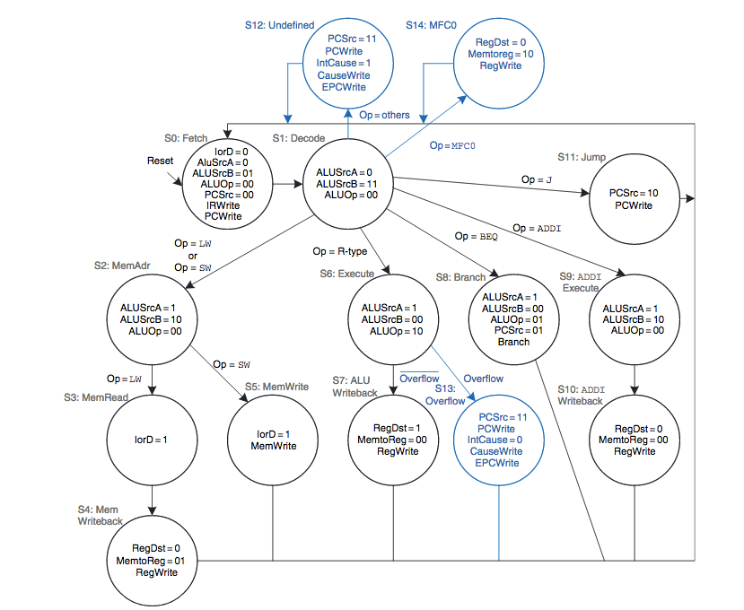
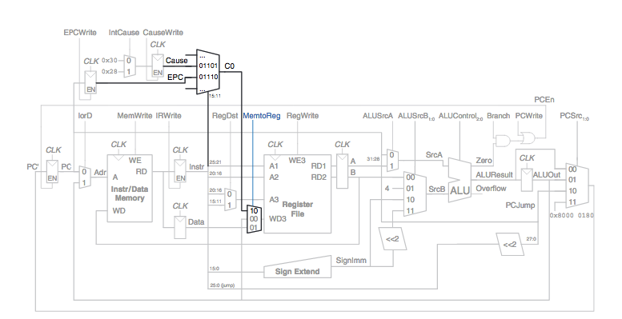

# MIPS Processor
In this project, a 32-bit multi-cycle MIPS processor that supports exceptions is implemented in Verilog HDL.

# Goals
1. This machine is designed to be able to execute a variety of instructions in a multicycle implementation.
2. The multicycle processor should support two types of exceptions: undefined instructions and arithmetic overflow.

# Implementation

The multicycle implementation breaks instructions down into multiple steps. These steps typically are the:
1. Instruction fetch step
2. Instruction decode and Register fetch step
3. Execution, memory address computation, or branch completion step 
4. Memory access or R-type instruction completion step
5. Memory read completion step

In each short step, the processor can read or write the memory or register file or use the ALU. Different instructions use different numbers of steps, so simpler instructions can complete faster than more complex ones. The processor needs only one adder; this adder is reused for different purposes on various steps. And the processor uses a combined memory for instructions and data. The instruction is fetched from memory on the first step, and data may be read or written on later steps.
we add nonarchitectural state elements to hold intermediate results between the steps.

## Instructions
1. Add : R[rd] = R[rs] + R[rt]
2. Subtract : R[rd] = R[rs] - R[rt]
3. And: R[rd] = R[rs] & R[rt]
4. Or : R[rd] = R[rs] | R[rt]
5. SLT: R[rd] = 1 if R[rs] <  R[rt] else 0
6. Lw: R[rt] = M[R[rs]+SignExtImm]
7. Sw : M[R[rs]+SignExtImm] = R[rt]
8. Beq : if(R[rs]==R[rt]) PC=PC+1+BranchAddr
9. J : PC=JumpAddr

* Based on the provided instruction set, the data-path and control unit are designed and implemented.

## Dependencies

### Linux

##### Ubuntu
This project needs [Xlinx ISE](https://en.wikipedia.org/wiki/Xilinx_ISE) and python3.

## Building on Ubuntu

1. Download [Full Installer for Linux](https://www.xilinx.com/support/download/index.html/content/xilinx/en/downloadNav/design-tools/v2012_4---14_7.html) from here. See [How to install Xilinx ISE on Ubuntu](https://www.youtube.com/watch?v=meO-b6Ib17Y&ytbChannel=null).
2. Install Python 3.6 via command : <code>  $ sudo apt-get install python3.6 </code>

3. Clone the repository.
4. Change the directory to MipsAssembler.
5. Type MIPS code to see it in binary form in src folder.
6. Synthesize and simulate the verilog design in src folder to see the results.
7. That's all !

## Control_Unit FSM

## Data Path

